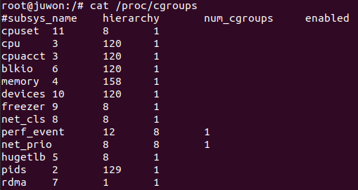
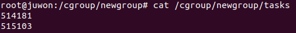

- Control Groups provide a mechanism for aggregating/partitioning

    sets of tasks, and all their future children,
    
    into hierarchical groups with specialized behaviour.
    
    A *cgroup* associates a set of tasks with
    
    a set of parameters for one or more subsystems.
    

## Cgroup

**프로세스를 그룹화**해서 관리하기 위한 리눅스 커널의 기능이다.

cgroup 자체는 프로세스를 그룹화하기 위한 기능과

인터페이스를 제공하기 위한 인프라이고,

이를 이용해 I/O 나 메모리 할당 제어 같은 구체적인 리소스 관리 기능이 구현된다.

구체적인 리소스 관리 기능은 cgroup subsystem 또는 컨트롤러 라고 한다.

- cgroup subsystem 의 종류
    
    **Memory 컨트롤러** (메모리 제어), **CPU 컨트롤러** (프로세스 스케줄링 제어) 등
    
    실행 중인 커널에서 이용 가능한 cgroup subsystem 은 `/proc/cgroups` 에서
    
    확인이 가능하다.
    
    
    

cgroup 은 **그룹관리나 각 subsystem 을 설정하기 위한 인터페이스**로

cgroup 파일 시스템이라는 **가상 파일시스템**을 제공하고 있다.

따라서 cgroup 을 사용하기 위해서는 cgroup 파일 시스템을 mount 해야 한다.

이 때 mount 옵션으로 어떤 subsystem 을 사용할 것인지를 지정한다.
<br />
<br />

### cgroup 생성
---

간단한 예제로 root 경로에 cgroup 이라는 디렉토리를 만들고,

cgroup 의 memory 컨트롤러를 mount 시켜보자.

```bash
mkdir /cgroup
mount -t cgroup -o memory cgroup /cgroup
cd /cgroup
ls
```

mount 명령어의 옵션을 살펴보면 파일시스템은 -t 옵션으로

cgroup 가상 파일시스템으로 지정한다.

-o 옵션에서 cgroup 하위의 memory 컨트롤러를 지정한 뒤

cgroup 을 임의로 만든 /cgroup 디렉토리에 mount 시킨다.


위와 같이 cgroup 의 memory 컨트롤러가 나타내는 특수 파일들이 보이는 것을

확인할 수 있다.

mount 할 때 지정하는 옵션, 즉 어떤 subsystem 을 사용할지에 따라

존재하는 파일은 달라진다.

파일에는 readonly 파일과 읽기/쓰기 가능한 것이 있다.

readonly 파일은 유저에게 정보를 제공하기 위한 파일이고,

읽기/쓰기 가능한 파일은 값을 써서 cgroup 및 cgroup subsystem 의 설정을

변경하기 위한 파일이다.

특수 파일 중에서 가장 중요한 것은 tasks 라는 파일이다.


tasks 파일 안에 나열되어 있는 숫자는 이 *그룹* 에 속해있는 쓰레드의 TID 이다.

시스템에서 실행되고 있는 모든 쓰레드의 TID 가 /cgroup/tasks 에 포함되어 있다.

여기서 *그룹* 이란, cgroup 파일시스템의 디렉토리로 표현되는 쓰레드의 집합이다.

디렉토리 하나가 하나의 *그룹* 이라고 표현할 수도 있다.

cgroup 을 mount 하기 위해 /cgroup 이라는 디렉토리를 만들었는데,

/cgroup 역시 디렉토리이므로 하나의 그룹을 나타내고 있다.

여기서 /cgroup 은 mount point 의 최상위에 있는 디렉토리이고 자동으로

생성되는 그룹으로, root group 이라고 한다.

이 단계에서는 /cgroup, 즉 root group 만이 시스템에 존재하는 유일한 그룹이다.

kernel 은 cgroup 이라는 특별한 파일 시스템을 통해 그룹을 만들고

조작할 수 있게 제공한다.

따라서 mount 한 /cgroup 디렉토리 아래 새로운 하위 디렉토리를 만들면

새로운 *그룹* 을 만들 수 있다.

```bash
mkdir /cgroup/newgroup
ls /cgroup/newgroup
```


새로 생성한 디렉토리 (cgroup) 에는 상위 디렉토리와 마찬가지로

특수 파일들을 kernel 이 자동으로 생성한다.

> 단, release_agent 파일은 최상위 cgroup 에만 존재
> 

새로 생성한 cgroup 의 tasks 를 확인해보면 내부가 비어있는 것을 알 수 있다.

아직 이 그룹에 쓰레드가 하나도 속해있지 않기 때문이다.

적당한 쓰레드를 이 그룹에 소속시켜보자.

```bash
echo $$ # 사용하고 있는 shell 의 pid값 출력
echo $$ > /cgroup/newgroup/tasks
cat /cgroup/newgroup/tasks
```


tasks 의 내용에 shell 의 TID (PID 이기도 함) 인 514181 이 포함되어 있다는 것을 통해

shell 이 newgroup 에 소속되어 있음을 알 수 있다.

그런데 이 그룹에는 514796 이라는 쓰레드가 하나 더 소속되어 있다.

tasks 의 내용을 한 번 더 출력해보자.



두 번째 TID 가 변경된 것을 확인할 수 있다.

이 부분은 tasks 의 내용을 출력시킨 cat 프로세스이다.

첫 번째 cat 과 두 번째 cat 은 다른 프로세스이기 때문에 TID 가 달라서 결과가 달라졌다.

#### cat 프로세스를 newgroup 에 소속시킨 적이 없는데 ?

> 그 이유는 그룹에 소속되어 있는 프로세스가 자식 프로세스를 생성하면,
> 
> 
> 해당 자식 프로세스는 자동으로 부모 프로세스의 그룹에 속하기 때문이다.
> 
> cat 은 shell 의 자식 프로세스이므로 자동으로 newgroup 에 소속된 것이다.
> 

cgroup 파일시스템을 mount 한 직후에

시스템의 모든 쓰레드가 root group 에 소속되어 있었던 것을 떠올려보면, 이해가 쉽다.

이제 shell 의 TID (여기서는 514181) 를 root group 으로 되돌려보자.

```bash
echo 514181 > /cgroup/tasks
```

이제 /cgroup/newgroup/tasks 는 비게 되고,

쓰레드가 하나도 소속되어 있지 않은 그룹은

파기할 수 있다. 그룹은 디렉토리를 삭제함으로써 파기된다.
<br />
<br />

### cgroup 제거
---

cgroup 을 제거할 때는 반대로 디렉토리를 제거하면 된다.

다만 cgroup 에 속한 task 가 없어야 가능하다.

제거하고자 하는 그룹 디렉토리 안의 notify_on_release 파일의 값을 1로 세팅해주면,

release_agent 로 지정된 프로그램에게 알려준다.

release_agent 로 사용할 프로그램을 shell script 를 이용해서

/release.sh 이라는 이름으로 작성해보았다.

```bash
#!/bin/bash

echo cgroup $1 released! > /tmp/cgroup-release-msg
```

release_agent 는 커널이 background 에서 실행시키기 때문에

echo 를 이용해 메시지를 출력해도 터미널에서는 볼 수 없다.

여기서는 특정 파일에 기록하도록 하였다.

이제 실행권한을 주고 release_agent 로 등록한다.

```bash
chmod +x /release.sh
echo /release.sh > /cgroup/release_agent
```

notify_on_release 를 1로 세팅한다.

```bash
echo 1 > /cgroup/newgroup/notify_on_release
```

그룹을 바로 삭제한다고 release_agent 가 호출되지는 않는다.

해당 그룹에서 하나 이상의 동작이 이루어져야 notify 기능이 활성화된다.

삭제를 위해 간단히 task 를 그룹에 추가한 후에 다시 제거한다.

```bash
echo $$ > /cgroup/newgroup/tasks
echo $$ > /cgroup/tasks
```

이제 newgroup 그룹을 삭제해보면 release_agent 가 실행되었음을 확인할 수 있다.

```bash
rmdir /cgroup/newgroup
cat /tmp/cgroup-release-msg
```

---

[참고 URL]

- [https://www.kernel.org/doc/html/latest/admin-guide/cgroup-v1/cgroups.html](https://www.kernel.org/doc/html/latest/admin-guide/cgroup-v1/cgroups.html)
- [http://egloos.zum.com/studyfoss/v/5505982](http://egloos.zum.com/studyfoss/v/5505982)

[참고 서적]

- 리눅스 커널 HACKS (다카하시 히로카즈 감수)